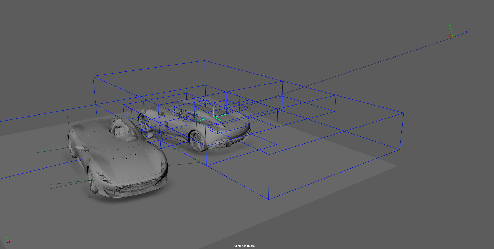
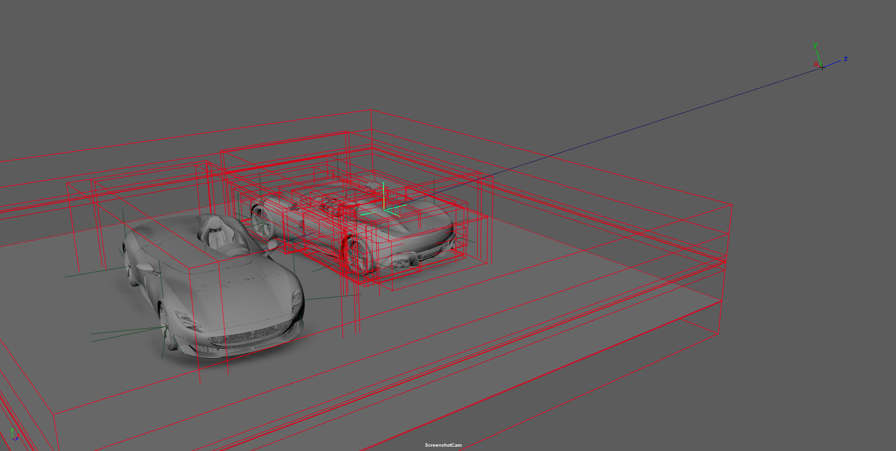

# Maya GetClosestIntersection

This repository is intended to serve as a base introduction into creating a Maya plug-in to cast a ray out into the scene and return the closest intersection. This could be used to extend to a rigging tool for automatically placing locators at the mouse-click location or a tool to interactively drag objects around the scene from a 2d viewpoint.


Despite the scope of the problem at hand being limited, it comes with a lot of convenience / helper files to illustrate how one could build a larger Maya API project.

# Installation

To install Maya GetClosestIntersection place both `GetClosestIntersection.py` and `GetClosestIntersection/` on your `MAYA_PLUG_IN_PATH` which has the following defaults on windows
```
<user’s directory>/Documents/Maya/<version>/plug-ins
<user’s directory>/Documents/Maya/plug-ins
<maya_directory>/bin/plug-ins#
```

Finally, to initialize the context execute the code in `shelfButton.py` or drag it onto your shelf as a button

# Usage

> [!NOTE]
> The code is built for Python 3.6+ or Maya 2022+ with Python 3 mode. If you wish to use an earlier version you must port the code to py2


As this codebase implements a Maya Plug-in already, the intended usage is to either modify the existing code to extend it to the desired feature set, or implementing just `GetClosestIntersection/` without the `GetClosestIntersection.py` plug-in initializer. 

After which, in your own plug-in initialization file 
```py
import GetClosestIntersection.context.closest_intersection_ctx as closest_intersection_ctx
```
after which you use `registerContextCommand` and `deregisterContextCommand` on the `ClosestIntersectionContextCommand`.

If you wish to specify which acceleration structure to use (defaults to BVH, for reasoning head to [this section](#benchmarking)), modify the `constants.py` file found under  `GetClosestIntersection/`. 

# Contributing

Any kind of contributions to the project are more than welcome! Be it writing more elaborate docs or extending / improving the code. Once done, submit a PR and I will have a look : )

If you aim to work on the code itself it would likely be a good idea to have some sort of dynamic reloading logic in place as can be seen in this [article](https://www.aleksandarkocic.com/2020/12/19/live-reload-your-python-code-in-maya/)

# Performance

Despite what one might think, the main performance bottlenecks for finding the closest intersection is the Maya API call to `MFnMesh.getClosestIntersection()`. As such, any reduction in the amount of times this function is called will offer considerable reductions in computation time. This may be trivial for small scenes without many objects but can become quite the burden for larger mesh samples as can be seen in the [benchmarks](#benchmarking) below.

To lessen the time required to compute an intersection two different types of spacial acceleration structures have been implemented. Both of these can be found under `/core/acceleration_structures/` and can run entirely independant of each other. The goal of these structures is to be able to quickly "filter" the scene to contain only relevant items.

Keep in mind that the actual call to `MFnMesh.getClosestIntersection()` does also use an acceleration structure in and of itself which can be passed as a parameter to the function. Therefore we are doing the same thing but one level higher.

### Octree


> Preview of the octree intersection testing at a max depth of 3 using the [Monza SP1](https://www.artstation.com/artwork/mzAWOY) model graciously provided by [Saksham Kumar](https://www.behance.net/sk0441) and [Adam Wiese](https://www.behance.net/Adam-Wiese). Generated by enabling the DEBUG flag in `constants.py`

[Octrees](https://en.wikipedia.org/wiki/Octree) are the simpler of the two structures, partitioning the complete scene bounding box into a recursive tree of eights until a certain depth or condition is met. In the case of this implementation, it is bound by depth, as can be seen by its signature.
```py
class Octree:

    def __init__(self, mesh_list: mesh_list.MFnMeshList, bbox: om.MBoundingBox, depth: int = 3):
```

While an octree is simple in construction, in most real-world scenes it will result in an unbalanced tree, i.e. some nodes will be much further down the tree than average. Empty leaf nodes are however culled during the build process to avoid iterating nodes without content. Additionally, this Octree implementation can have a single mesh reside in multiple bounding boxes at the same time. 


### Bounding Volume Hierarchies (BVH)


> Preview of the BVH intersection testing at a max depth of 32 using the [Monza SP1](https://www.artstation.com/artwork/mzAWOY) model graciously provided by [Saksham Kumar](https://www.behance.net/sk0441) and [Adam Wiese](https://www.behance.net/Adam-Wiese). Generated by enabling the DEBUG flag in `constants.py`

[Bounding Volume Hierarchies](https://en.wikipedia.org/wiki/Bounding_volume_hierarchy) are a similar type of spacial partitioning, with the major difference being that a mesh can be contained in only a single leaf node for a given tree. Additionally, bounding volumes are fitted around the meshes as much as possible to avoid overlap. This opens up the interesting optimization step, in which intersected bounding boxes can be sorted by distance. This means a closer bounding box is guaranteed to contain a closer mesh. 

Furthermore, the algorithm for splitting the Bounding Boxes is a median split (i.e. half the meshes go in one node, the other half in the other) which creates a much more balanced tree. This can be seen by running `BVH.pprint()` to visualize the binary tree

Finally, in this implementation BVH construction is much faster allowing for much deeper tree levels and therefore less collision tests.

```py
class BVH:

    def __init__(self, mesh_list: mesh_list.MFnMeshList, bbox: om.MBoundingBox, max_depth: int = 32):

```


## Benchmarking

> [!NOTE]
> Please note that for these benchmarks the samples were chosen at random in a way that they would still intersect the geometry as a non-intersection leads to a computation time of < 5 ms for the acceleration structures. 

> [!NOTE]
> All of these benchmarks were taken by enabling the VERBOSE_LOGGING flag in `constants.py`

Specs used for benchmarking
- `Maya 2023.3`
- `CPU: Threadripper 3960x 24-Core` *
- `RAM: 128 GB` 

**Code is only executed on a single of these 24-Cores*


### Car Dataset

**Scene Info**
- `Object Count: 5,515`
- `Tri Count: 45,242,012 `

<details open>
    <summary> Results </summary>


|                           | BruteForce    | Octree    | BVH       |
| ---                       | :--------:    | :----:    | :------:  |
| Mesh init                 | 539 ms        | 539 ms    | 539 ms    |
| Max Tree Depth*           | N/A           | 3         | 20        |          
| Accel Structure init      | N/A           | 432 ms    | 75 ms     |
| **Total Initialization**  | **539 ms**    | **971 ms**| **614 ms**|
|                           |               |           |           | 
| *Sample 1*                | *2355 ms*     | *334 ms*  | *139 ms*  |
| *Sample 2*                | *2259 ms*     | *472 ms*  | *107 ms*  |
| *Sample 3*                | *2272 ms*     | *407 ms*  | *68 ms*   |
| *Sample 4*                | *2271 ms*     | *399 ms*  | *176 ms*  |
| *Sample 5*                | *2448 ms*     | *330 ms*  | *90 ms*   |
| *Sample 6*                | *2306 ms*     | *349 ms*  | *47 ms*   |
| *Sample 7*                | *2297 ms*     | *680 ms*  | *85 ms*   |
| *Sample 8*                | *2297 ms*     | *193 ms*  | *39 ms*   |
| *Sample 9*                | *2301 ms*     | *705 ms*  | *74 ms*   |
| *Sample 10*               | *2289 ms*     | *277 ms*  | *23 ms*   |
|                           |               |           |           |
| **Median Average**        | **2297 ms**   | **374 ms**| **80 ms** |
| **Mean Average**          | **2309 ms**   | **415 ms**| **85 ms** |

**Max Tree Depth refers to the maximum allowed depth, not necessarily the maximum actual depth*

</details>

---

### Full CG Environment

**Scene Info**
- `Object Count: 7341`
- `Tri Count: 55,262,706 `
<details open>
    <summary> Full Data </summary>

|                           | BruteForce    | Octree    | BVH       |
| ---                       | :--------:    | :----:    | :------:  |
| Mesh init                 | 955 ms        | 955 ms    | 955 ms    |
| Max Tree Depth*           | N/A           | 3         | 20        |          
| Accel Structure init      | N/A           | 561 ms    | 137 ms    |
| **Total Initialization**  | **955 ms**    |**1516 ms**|**1092 ms**|
|                           |               |           |           | 
| *Sample 1*                | *2771 ms*     | *1634 ms* | *137 ms*  |
| *Sample 2*                | *2129 ms*     | *1641 ms* | *127 ms*  |
| *Sample 3*                | *2131 ms*     | *1627 ms* | *100 ms*  |
| *Sample 4*                | *2129 ms*     | *1649 ms* | *132 ms*  |
| *Sample 5*                | *2133 ms*     | *1630 ms* | *113 ms*  |
| *Sample 6*                | *2117 ms*     | *1633 ms* | *120 ms*  |
| *Sample 7*                | *2109 ms*     | *1631 ms* | *119 ms*  |
| *Sample 8*                | *2149 ms*     | *1627 ms* | *208 ms*  |
| *Sample 9*                | *2112 ms*     | *2043 ms* | *213 ms*  |
| *Sample 10*               | *2163 ms*     | *2055 ms* | *156 ms*  |
|                           |               |           |           |
| **Median Average**        | **2130 ms**   |**1634 ms**| **130 ms**|
| **Mean Average**          | **2194 ms**   |**1717 ms**| **143 ms**|

**Max Tree Depth refers to the maximum allowed depth, not necessarily the maximum actual depth*

</details>

---

### [Animal Logic ALab](https://dpel.aswf.io/alab/)

**Scene Info**
- `Object Count: 4725`
- `Tri Count: 26,124,526 `
<details open>
    <summary> Full Data </summary>

|                           | BruteForce    | Octree    | BVH       |
| ---                       | :--------:    | :----:    | :------:  |
| Mesh init                 | 585 ms        | 585 ms    | 585 ms    |
| Max Tree Depth*           | N/A           | 3         | 20        |          
| Accel Structure init      | N/A           | 359 ms    | 61 ms     |
| **Total Initialization**  | **585 ms**    |**944 ms** |**646 ms** |
|                           |               |           |           | 
| *Sample 1*                | *495 ms*      | *403 ms*  | *53 ms*   |
| *Sample 2*                | *500 ms*      | *420 ms*  | *15 ms*   |
| *Sample 3*                | *502 ms*      | *408 ms*  | *17 ms*   |
| *Sample 4*                | *460 ms*      | *425 ms*  | *16 ms*   |
| *Sample 5*                | *493 ms*      | *410 ms*  | *17 ms*   |
| *Sample 6*                | *515 ms*      | *455 ms*  | *22 ms*   |
| *Sample 7*                | *516 ms*      | *456 ms*  | *35 ms*   |
| *Sample 8*                | *516 ms*      | *418 ms*  | *14 ms*   |
| *Sample 9*                | *515 ms*      | *479 ms*  | *25 ms*   |
| *Sample 10*               | *511 ms*      | *397 ms*  | *37 ms*   |
|                           |               |           |           |
| **Median Average**        | **507 ms**    |**422 ms** | **20 ms** |
| **Mean Average**          | **502 ms**    |**439 ms** | **25 ms** |

**Max Tree Depth refers to the maximum allowed depth, not necessarily the maximum actual depth*

</details>